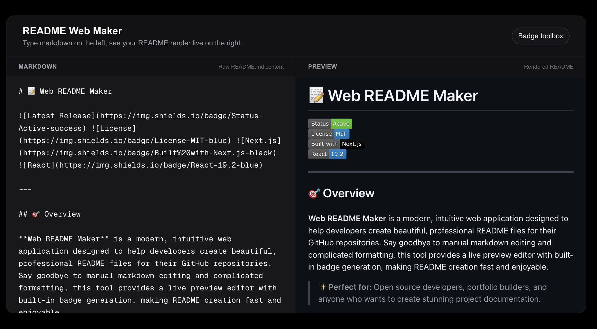
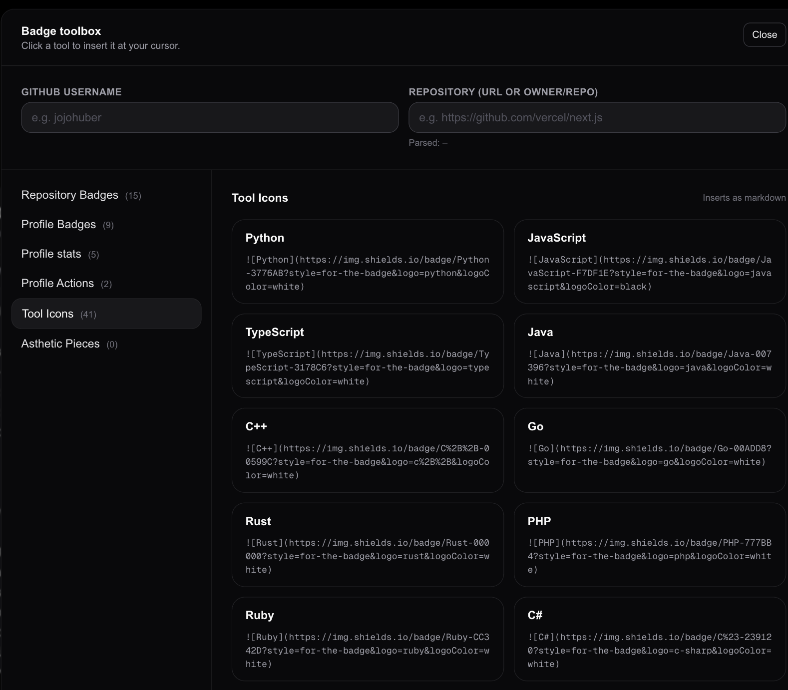

# 📝 Web README Maker

   

---

## 🎯 Overview

**Web README Maker** is a modern, intuitive web application designed to help developers create beautiful, professional README files for their GitHub repositories. Say goodbye to manual markdown editing and complicated formatting, this tool provides a live preview editor with built-in badge generation, making README creation fast and enjoyable.

> ✨ **Perfect for**: Open source developers, portfolio builders, and anyone who wants to create stunning project documentation.

---

## 🌟 Features

### 🎨 **Live Markdown Editor**
- **Real-time preview** as you type your markdown
- **Syntax-highlighted** editor for better readability
- **Split-view layout** with editor on the left, live preview on the right
- **GitHub-flavored markdown** (GFM) support including tables, strikethrough, and task lists
- **HTML support** with sanitization for safe rendering

### 🏷️ **Intelligent Badge Toolbox**
Generate beautiful, customizable badges with just a few clicks:

#### Repository Badges
- 📊 GitHub stars counter
- 🍴 Forks counter
- 📦 Latest release version
- 🔝 Top programming language
- 📏 Code size indicator
- 📝 License badges (MIT and others)
- ⭐ Custom colored badges

#### Developer & Social Badges
- 👤 GitHub profile stats
- 📊 GitHub activity graphs
- 🎯 Skill badges (programming languages, frameworks, tools)
- 💬 Social media links (Twitter, LinkedIn, Discord, etc.)

#### Theme Support
- 60+ stunning themes for stats cards and profile elements
- Themes include: GitHub Dark, Dracula, Nord, Catppuccin, Rose Pine, and many more
- Fully customizable colors and styles

### 🎯 **Smart Repository Integration**
- **Quick input**: Simply enter `owner/repo` or paste a full GitHub URL
- **Auto-detection**: Automatically parses repository information
- **Template filling**: Seamlessly inserts your repository details into badge templates
- **Context-aware**: Different modes for repository and profile badges

### 🎨 **Customization Options**
- **Color picker**: Choose from 13+ predefined colors with visual swatches
- **Custom colors**: Enter hex color codes for unlimited customization
- **Theme selector**: Browse and apply themes from an extensive library
- **Social username input**: Personalize badges with your username or handle

---

## 💻 How to Use

### Basic Workflow

1. **Start Editing**: Begin with the default template or clear and write your own markdown
2. **Live Preview**: Watch your README render in real-time on the right side
3. **Add Badges**: Click the "Badge Toolbox" button to open the badge generator
4. **Customize**: Select badge types, colors, and themes to match your style
5. **Insert**: Click to add badges to your markdown at the cursor position
6. **Export**: Copy your complete README and paste it into your repository

### Badge Toolbox Guide

#### Repository Badges
- Enter your GitHub username and repository name
- Select badge type (stars, forks, release, language, etc.)
- Click to insert into your README

#### Repository Stats with Themes
- Perfect for showcasing GitHub statistics
- 60+ themes available: GitHub Dark, Dracula, Nord, Catppuccin, and more
- Pick your favorite theme to match your personal brand

#### Social Badges
- Add links to your GitHub profile
- Connect to social media (Twitter, LinkedIn, Discord, etc.)
- Customize with your username or handle

#### Custom Badges
- Create any custom colored badge
- Use from 13+ preset colors or enter custom hex codes
- Perfect for adding custom sections to your README

---

## 🎨 Design & User Experience

### Responsive Interface
- **Desktop optimized** with clean, modern layout
- **Intuitive controls** that require no learning curve
- **Accessible design** following web accessibility standards

### Editor Features
- **Auto-formatted** markdown with proper spacing
- **Cursor-aware** insertion for precise badge placement
- **Smart newline handling** to keep your markdown clean

### Visual Feedback
- **Color swatches** for quick color selection
- **Real-time previews** of badges before insertion
- **GitHub markdown styling** in the preview panel

---

## 🛠️ Tech Stack

### Frontend
- **Next.js 16.1** - React framework for production
- **React 19.2** - UI library
- **TypeScript** - Type-safe development
- **Tailwind CSS 4** - Utility-first styling

### Markdown Processing
- **react-markdown** - Render markdown to React components
- **remark-gfm** - GitHub Flavored Markdown support
- **rehype-raw** - Parse raw HTML in markdown
- **rehype-sanitize** - Safe HTML sanitization
- **github-markdown-css** - GitHub's markdown styles

### Development Tools
- **ESLint** - Code quality linting
- **TypeScript** - Static type checking

---

## 📸 Screenshots

### Main Editor Interface


### Badge Toolbox


---

## 🎯 Use Cases

### 📚 For Open Source Repositories
Create polished READMEs that showcase your project with impressive stats badges and consistent branding.

### 👤 For Github Profiles
Add GitHub profile cards with customized themes to highlight your contributions and stats.

---

## 🔄 Workflow Examples

### Example 1: Repository Badge Setup
```markdown
# My Awesome Project

[](...)
[](...)
[](...)

Your project description here...
```

### Example 2: Enhanced Profile Section
```markdown
## 📊 GitHub Stats


[](...)
```

---

## 🤝 Contributing

We welcome contributions! Whether you're fixing bugs, adding features, or improving documentation:

1. **Fork** the repository
2. **Create** your feature branch (`git checkout -b feature/amazing-feature`)
3. **Commit** your changes (`git commit -m 'Add amazing feature'`)
4. **Push** to the branch (`git push origin feature/amazing-feature`)
5. **Open** a Pull Request

## 📄 License

This project is licensed under the **MIT License** - see the [LICENSE](LICENSE) file for details.

---

## 💡 Tips & Tricks

### Pro Tips for Better READMEs
- **Start with a clear hook**: Grab attention in your first line
- **Use badges strategically**: Don't overcrowd—quality over quantity
- **Keep it scannable**: Use headers and short paragraphs
- **Add visual elements**: Include screenshots and GIFs
- **Include a roadmap**: Show future plans to build interest


## 📞 Support & Feedback

Have a question, bug report, or feature request?

- 🐛 **Found a bug?** [Open an issue](https://github.com/yourusername/Web-README-Maker/issues)
- 💡 **Have an idea?** [Start a discussion](https://github.com/yourusername/Web-README-Maker/discussions)

---


## 📈 Project Stats

  
  


---

## 🎉 Let's Create Amazing READMEs Together!

Start using **Web README Maker** today and transform your project documentation. Your repository deserves a README that shines! ✨

---

<div align="center">

**[🚀 Launch Web README Maker](#)** | **[📖 Documentation](#)** | **[💬 Discussions](#)** | **[⭐ Star on GitHub](#)**

Made with ??

</div>

